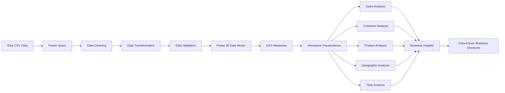
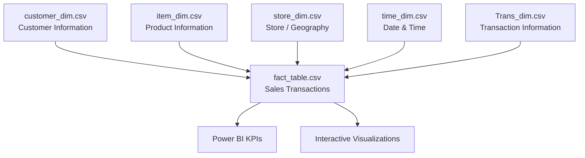
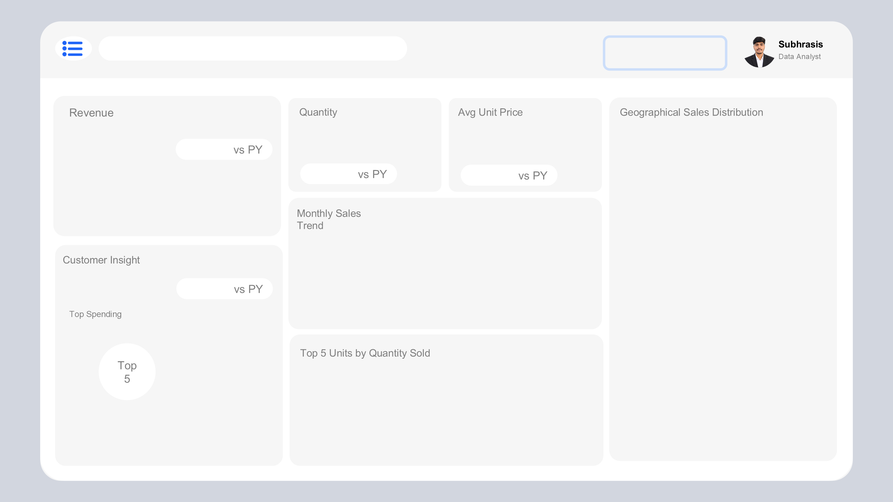

# 🛒 E-Commerce Sales Analytics | Power BI

<p align="center">
  
</p>

<h3 align="center">Interactive E-Commerce Sales Performance & Customer Insights Dashboard</h3>

<p align="center">
  <b>Power BI • Data Modeling • ETL • DAX • Business Intelligence • Data Visualization</b>
</p>

---

## 📌 Project Overview

**E-Commerce Sales Analytics** is an end-to-end **Business Intelligence project built with Microsoft Power BI** to transform transactional e-commerce data into meaningful business insights.

The project focuses on understanding:

- 📈 Overall sales performance
- 💰 Revenue and sales trends
- 🛍️ Product performance
- 👥 Customer behavior
- 🌍 Geographic sales distribution
- 📅 Time-based sales patterns
- 🏪 Store/location performance
- 💳 Transaction and payment information

The objective is to convert raw transactional and dimensional data into an **interactive analytical dashboard that supports data-driven business decisions**.

---

# 🎯 Business Problem

E-commerce businesses generate large volumes of transactional data across customers, products, locations, transactions, and time.

Raw data alone does not provide an efficient way for business stakeholders to answer questions such as:

> **What is driving sales performance? Which products and locations are performing best? How are sales changing over time? Who are the customers contributing to business performance?**

This project addresses these questions by building a centralized Power BI analytics solution.

### Key Business Questions

| Business Area | Questions Answered |
|---|---|
| 📈 Sales | How is sales performance changing over time? |
| 💰 Revenue | What are the major revenue and sales KPIs? |
| 🛍️ Products | Which products contribute most to sales volume? |
| 👥 Customers | How does customer behavior contribute to performance? |
| 🌍 Geography | Which regions/stores generate stronger sales? |
| 📅 Time | Which months, weekdays, or periods perform better? |
| 💳 Transactions | How are different transaction types contributing to sales? |

---

# 🏢 Business Value

This dashboard is designed from a **business decision-making perspective**, not just as a visualization exercise.

### 1. Sales Performance Monitoring

Management can quickly monitor overall sales KPIs and identify changes in business performance.

### 2. Product Strategy

Product-level analysis helps identify high-volume products and areas that may require additional inventory, promotion, or pricing attention.

### 3. Customer Understanding

Customer-level information provides visibility into purchasing behavior and helps identify opportunities for customer retention and targeted marketing.

### 4. Geographic Performance

Regional and store-level analysis helps identify strong-performing and underperforming locations.

### 5. Time-Based Planning

Monthly and time-based trends can support:

- Demand planning
- Inventory management
- Promotional planning
- Seasonal strategy
- Resource allocation

### 6. Management Reporting

Instead of relying on multiple disconnected spreadsheets, decision-makers can use a centralized interactive dashboard to explore business performance.

---

# 🧰 Tools & Technologies

| Technology | Purpose |
|---|---|
| **Microsoft Power BI** | Dashboard development & visualization |
| **Power Query** | Data cleaning & transformation |
| **DAX** | KPI and analytical calculations |
| **CSV** | Source data |
| **Data Modeling** | Relationships between fact and dimension tables |
| **Git & GitHub** | Version control & project documentation |

---

# 📊 Dashboard Preview

## E-Commerce Sales Performance Dashboard

<p align="center">
  
</p>

### Dashboard Focus Areas

The dashboard provides an interactive view of:

- **Sales KPIs**
- **Sales quantity**
- **Average unit price**
- **Monthly sales trends**
- **Customer insights**
- **Product performance**
- **Geographic sales distribution**
- **Store/location analysis**

Users can interact with the dashboard to explore different business dimensions and identify performance patterns.

---

# 🔄 End-to-End Data Analytics Workflow



### Workflow Explanation

**1. Raw Data Collection**

Multiple CSV files provide transactional and dimensional information.

**2. Data Preparation**

Power Query is used to clean, transform, validate, and prepare the datasets.

**3. Data Modeling**

Fact and dimension tables are connected through appropriate relationships.

**4. DAX Analysis**

Measures and calculations are created to generate meaningful KPIs and analytical metrics.

**5. Visualization**

Power BI visuals convert analytical results into an interactive dashboard.

**6. Business Insights**

The dashboard allows stakeholders to identify trends, compare performance, and support business decisions.

---

# 🧩 Data Model

The project follows a dimensional analytical structure where the central fact table is supported by multiple dimension tables.



### Data Model Components

| Dataset | Purpose |
|---|---|
| `fact_table.csv` | Central transactional/sales fact data |
| `customer_dim.csv` | Customer-related information |
| `item_dim.csv` | Product/item information |
| `store_dim.csv` | Store and geographic attributes |
| `time_dim.csv` | Date and time attributes |
| `Trans_dim.csv` | Transaction/payment-related attributes |

---

# 🗄️ Dataset Overview

The repository contains the following datasets:

### `fact_table.csv`

The central transaction-level dataset used for sales analysis.

It acts as the primary analytical fact table connecting transactional activity with customer, product, store, time, and transaction dimensions.

### `customer_dim.csv`

Contains customer-related information used for customer-level analysis.

Current repository size: approximately **9,192 records**.

### `item_dim.csv`

Contains product/item information such as:

- Item
- Item name
- Description
- Unit price
- Manufacturing country
- Supplier
- Unit

Current repository size: approximately **265 records**.

### `store_dim.csv`

Contains store and geographic information including:

- Store
- Division
- District
- Upazila

Current repository size: approximately **727 records**.

### `time_dim.csv`

Provides time-related attributes used for chronological and period-based analysis.

### `Trans_dim.csv`

Contains transaction-related information including transaction type and bank/payment-related attributes.

---

# 📐 Analytical Model

The analytical structure can be represented as:

```text
                    ┌──────────────────┐
                    │  Customer Dim    │
                    └────────┬─────────┘
                             │
                             │
┌──────────────────┐         ▼
│    Item Dim      │ ───► Fact Table ◄──── Store Dim
└──────────────────┘         │
                             │
                             ▼
                       ┌────────────┐
                       │  Time Dim  │
                       └────────────┘
                             ▲
                             │
                       Trans Dim
```

This structure allows Power BI to analyze the same transactional activity across multiple business dimensions.

---

# 📈 Key Analytical Areas

## 💰 Sales Performance

Analyze overall sales performance using KPI cards and trend visualizations.

The analysis helps answer:

- How much are we selling?
- How is performance changing?
- Which periods perform better?

---

## 📅 Time-Based Analysis

Sales trends can be analyzed across different time periods to identify:

- Monthly trends
- Seasonal patterns
- Weekday performance
- High and low-performing periods

---

## 🛍️ Product Analysis

Product analysis helps identify:

- Top-selling products
- Product demand
- Quantity contribution
- Average unit price patterns

This can support inventory planning and product strategy.

---

## 👥 Customer Analysis

Customer information can be used to understand:

- Customer contribution to sales
- Purchasing patterns
- Customer-level performance
- Opportunities for retention and targeted campaigns

---

## 🌍 Geographic Analysis

Store and geographic information enables comparison across locations.

This can help identify:

- High-performing regions
- Underperforming locations
- Geographic sales concentration
- Opportunities for regional expansion

---

## 💳 Transaction Analysis

Transaction information provides additional context around how sales are processed and supports transaction-level performance analysis.

---

# 🎨 Power BI Theme

The project also includes a custom visual theme used for dashboard presentation.

<p align="center">
  
</p>

---

# 📂 Project Structure

```text
E-Commerce-Sales-Analytics/
│
├── 📊 E-Commerce Sales Performance & Customer Insights.pbix
│
├── 🖼️ E-Commerce Sales Performance Dashboard.png
├── 🎨 Theme.png
│
├── 📄 Trans_dim.csv
├── 👥 customer_dim.csv
├── 📊 fact_table.csv
├── 🛍️ item_dim.csv
├── 🏪 store_dim.csv
├── 📅 time_dim.csv
│
└── README.md
```

---

# 🚀 How to Use the Project

### Step 1 — Clone the Repository

```bash
git clone https://github.com/Subhrasis-168/E-Commerce-Sales-Analytics.git
```

### Step 2 — Open the Project

Open:

```text
E-Commerce Sales Performance & Customer Insights.pbix
```

using **Microsoft Power BI Desktop**.

### Step 3 — Review the Data Model

Open the **Model view** in Power BI to understand relationships between the fact and dimension tables.

### Step 4 — Explore the Dashboard

Use available filters, slicers, KPIs, charts, and visual interactions to analyze sales and customer performance.

---

# 📌 Key Skills Demonstrated

This project demonstrates practical experience in:

- Microsoft Power BI
- Power Query
- Data Cleaning
- Data Transformation
- Data Modeling
- Dimensional Modeling
- DAX
- KPI Development
- Data Visualization
- Exploratory Data Analysis
- Sales Analytics
- Customer Analytics
- Product Analytics
- Geographic Analysis
- Business Intelligence
- Business Decision Support
- Git & GitHub

---

# 💼 Business Use Cases

The analytical framework can support several real-world e-commerce decisions.

| Business Function | Potential Use |
|---|---|
| Sales Management | Monitor sales performance |
| Marketing | Identify customer and product opportunities |
| Inventory | Understand product demand |
| Operations | Compare store/location performance |
| Finance | Monitor revenue-related KPIs |
| Management | Support performance reviews |
| Strategy | Identify growth opportunities |

---

# 🔍 Example Business Insights

The dashboard can be used to investigate questions such as:

> **Which products are driving the highest sales volume?**

> **Which locations are contributing most to overall performance?**

> **How does sales performance change month over month?**

> **Which customer segments or customers contribute significantly to sales?**

> **Which periods show stronger or weaker sales activity?**

> **Where should management focus inventory, marketing, or sales efforts?**

These questions demonstrate how the dashboard can move from **descriptive analytics to business decision support**.

---

# 📊 From Data to Decision

```mermaid
flowchart LR

A["Raw Transaction Data"] --> B["Clean & Transform"]
B --> C["Build Data Model"]
C --> D["Create DAX Measures"]
D --> E["Build Power BI Dashboard"]
E --> F["Identify Trends"]
F --> G["Generate Business Insights"]
G --> H["Support Business Decisions"]

style A fill:#E8F1FF
style B fill:#E8F1FF
style C fill:#E8F1FF
style D fill:#E8F1FF
style E fill:#DCEBFF
style F fill:#DCEBFF
style G fill:#DCEBFF
style H fill:#CFE2F3
```



---

# 🎓 Project Outcome

This project demonstrates an end-to-end approach to converting structured e-commerce data into a business intelligence solution.

The main outcome is an interactive **Power BI Sales Performance Dashboard** that brings together:

**Data → Transformation → Modeling → DAX → Visualization → Analysis → Business Insights**

The project showcases how Power BI can be used not only to create dashboards, but also to create a structured analytical layer that helps stakeholders understand business performance.

---

# 🔮 Future Improvements

Potential extensions include:

- 📈 Sales forecasting
- 👥 Customer segmentation
- 🛍️ Product profitability analysis
- 📊 Advanced DAX measures
- 🎯 Customer lifetime value analysis
- 🔄 Automated data refresh
- ☁️ Power BI Service deployment
- 📱 Mobile dashboard optimization
- 🚨 KPI alerts and anomaly detection

---

# 👨‍💻 Author

## Subhrasis Biswal

**Aspiring Data Analyst | Power BI | SQL | Excel | Python**

📍 Puri, Odisha, India

🔗 **GitHub:**  
https://github.com/Subhrasis-168

🔗 **LinkedIn:**  
https://www.linkedin.com/in/subhrasis-biswal-782a3b318/

---

## ⭐ If you found this project useful

Feel free to explore the repository, review the Power BI dashboard, and connect with me for discussions around **Data Analytics, Business Intelligence, Power BI, SQL, and Excel**.
